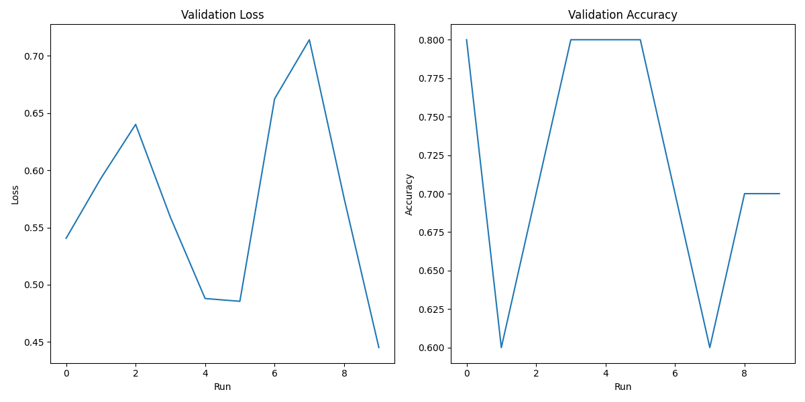

[](https://github.com/AnkitaMungalpara/HyperParameterTuning-ExperimentTracking/actions/workflows/hparam_optim.yaml)

# Hyperparameter Optimization and Report 🎯

This project focuses on **Hyperparameter Optimization** for a **CatDog Classification** model, leveraging powerful tools like **Aim**, **MLflow**, **DVC**, **CML**, **Hydra**, and **Optuna**. It demonstrates how to streamline experiment tracking, model tuning, and reporting with modern ML tools.


## Table of Contents 📑

- [Overview](#overview)
- [Tools and Frameworks](#tools-and-frameworks)
  - [Aim](#aim)
  - [MLflow](#mlflow)
  - [DVC](#dvc)
  - [CML](#cml)
  - [Hydra](#hydra)
  - [Optuna](#optuna)
- [Hyperparameter Optimization Results](#hyperparameter-optimization-results)
   - [Combined Metrics Plot](#combined-metrics-plot)
   - [Best Hyperparameters](#best-hyperparameters)
   - [Hyperparameters for Each Experiment](#hyperparameters-for-each-experiment)
   - [Test Accuracy Across Experiments (Epoch-wise)](#test-accuracy-across-experiments-epoch-wise)
- [References](#references)


## **Overview** 📘

This repository applies **hyperparameter optimization** techniques. It uses a sample dataset of 100 images per class from the [Chest X-Ray Pneumonia dataset](https://www.kaggle.com/datasets/paultimothymooney/chest-xray-pneumonia), and integrates cutting-edge ML tools to automate experiment tracking, model training, and reporting.


## Tools and Frameworks 🔧

### Aim 📝

[Aim](https://aimstack.io/) is an open-source tool designed for experiment tracking and visualization. It provides fast and efficient tracking for large-scale experiments, with an interactive web-based dashboard to compare runs.

#### Key Features:
- Lightweight and scalable experiment tracking.
- Rich visualizations for metrics and hyperparameter tuning.
- Easy to integrate with frameworks like **PyTorch** and **TensorFlow**.

#### Commands:
1. Start Aim dashboard:
   ```bash
   aim up
   ```
2. Run an experiment and track metrics:
   ```bash
   aim run python src/train.py experiment=<experiment_name>
   ```

### MLflow 📈

[MLflow](https://mlflow.org/) is an open-source platform for managing the end-to-end machine learning lifecycle, including experimentation, model packaging, and deployment.

#### Key Features:
- Logs parameters, metrics, and artifacts.
- Provides a model registry to store and version models.
- Powerful UI for visualizing and comparing multiple runs.

#### Commands:
1. Start the MLflow UI:
   ```bash
   mlflow ui
   ```
2. Run an experiment and log metrics:
   ```bash
   mlflow run . --experiment-name "<experiment_name>"
   ```

### **DVC** 📂

[DVC](https://dvc.org/) (Data Version Control) is a version control system tailored for machine learning projects, handling datasets and models.

#### Key Features:
- Manages datasets and models with Git-like version control.
- Integrates with cloud storage like Google Drive, AWS S3, and Azure.
- Ensures reproducibility across experiments by tracking datasets and models.

#### Commands:
1. Install dependencies and pull the dataset:
   ```bash
   UV_EXTRA_INDEX_URL=https://download.pytorch.org/whl/cpu uv sync
   ```
2. Pull the data from DVC:
   ```bash
   uv run dvc pull
   ```

### CML (Continuous Machine Learning) 🚀

[CML](https://cml.dev/) (Continuous Machine Learning) integrates machine learning workflows into **GitHub Actions** or **GitLab CI**, automating the entire pipeline.

#### Key Features:
- Automates ML pipelines within CI/CD systems.
- Generates reports for each experiment.
- Supports model evaluation and metrics reporting directly in GitHub/GitLab.

#### Commands:
1. Create reports and post results automatically during CI runs:
   ```bash
   uv run python scripts/generate_results.py
   ```

### Hydra ⚙️

[Hydra](https://hydra.cc/) is a framework for managing complex configurations in machine learning experiments. It simplifies running multiple configurations and allows you to easily override settings on the command line.

#### Key Features:
- Dynamic configuration management for complex projects.
- Supports multirun for running multiple experiments simultaneously.
- Easily override configuration values from the command line.

#### Commands:
1. Run a training script with configuration overrides:
   ```bash
   python src/train.py experiment=<experiment_name> +trainer.fast_dev_run=True
   ```
2. Run multiple experiments with different configurations:
   ```bash
   python src/train.py --multirun experiment=<experiment_name> model.embed_dim=16,32,64 +trainer.log_every_n_steps=5
   ```

### Optuna 🧪

[Optuna](https://optuna.org/) is an open-source hyperparameter optimization framework designed to efficiently search hyperparameter spaces for the best configurations.

#### Key Features:
- Efficient hyperparameter search using techniques like Bayesian optimization.
- Parallelization for faster search.
- Visualizations to help analyze search results.

#### Commands:
1. Run a hyperparameter search with Optuna:
   ```bash
   python src/train.py --multirun hparam=catdog_vit_hparam +trainer.log_every_n_steps=5 hydra.sweeper.n_jobs=4
   ```

# Hyperparameter Optimization Results

### Combined Metrics Plot



### Best Hyperparameters

|    | Parameter                        | Value                  |
|---:|:---------------------------------|:-----------------------|
|  0 | name                             | optuna                 |
|  1 | model.drop_path_rate             | 0.2089407556793585     |
|  2 | model.head_init_scale            | 0.9292090024255693     |
|  3 | model.lr                         | 0.00023458293902856107 |
|  4 | model.weight_decay               | 0.0005513192559352005  |
|  5 | data.batch_size                  | 64                     |
|  6 | augmentation.horizontal_flip     | True                   |
|  7 | augmentation.random_crop         | True                   |
|  8 | augmentation.random_rotation     | True                   |
|  9 | regularization.gradient_clipping | 0.15371010694861154    |
| 10 | best_value                       | 1.0                    |

### Hyperparameters for Each Experiment


|    | base_model    |   num_classes | pretrained   |     lr | optimizer   |   weight_decay |   scheduler_patience |   scheduler_factor |   drop_path_rate |   head_init_scale | horizontal_flip   | random_crop   | random_rotation   |   val_acc |   val_loss |
|---:|:--------------|--------------:|:-------------|-------:|:------------|---------------:|---------------------:|-------------------:|-----------------:|------------------:|:------------------|:--------------|:------------------|----------:|-----------:|
|  0 | convnext_nano |             2 | False        | 0.0003 | AdamW       |         0.0010 |                    3 |             0.1000 |           0.2257 |            0.6574 | True              | True          | True              |    0.8000 |     0.5406 |
|  1 | convnext_nano |             2 | False        | 0.0002 | AdamW       |         0.0006 |                    3 |             0.1000 |           0.2089 |            0.9292 | True              | True          | True              |    0.6000 |     0.5929 |
|  2 | convnext_nano |             2 | False        | 0.0005 | AdamW       |         0.0007 |                    3 |             0.1000 |           0.0723 |            1.0152 | True              | True          | True              |    0.7000 |     0.6401 |
|  3 | convnext_nano |             2 | False        | 0.0004 | AdamW       |         0.0000 |                    3 |             0.1000 |           0.2775 |            1.7625 | True              | True          | True              |    0.8000 |     0.5590 |
|  4 | convnext_nano |             2 | False        | 0.0002 | AdamW       |         0.0002 |                    3 |             0.1000 |           0.1194 |            1.6070 | True              | True          | True              |    0.8000 |     0.4880 |
|  5 | convnext_nano |             2 | False        | 0.0003 | AdamW       |         0.0009 |                    3 |             0.1000 |           0.2148 |            0.5226 | True              | True          | True              |    0.8000 |     0.4855 |
|  6 | convnext_nano |             2 | False        | 0.0009 | AdamW       |         0.0005 |                    3 |             0.1000 |           0.1251 |            1.5220 | True              | True          | True              |    0.7000 |     0.6624 |
|  7 | convnext_nano |             2 | False        | 0.0009 | AdamW       |         0.0003 |                    3 |             0.1000 |           0.0952 |            1.1222 | True              | True          | True              |    0.6000 |     0.7140 |
|  8 | convnext_nano |             2 | False        | 0.0001 | AdamW       |         0.0004 |                    3 |             0.1000 |           0.0881 |            1.4465 | True              | True          | True              |    0.7000 |     0.5756 |
|  9 | convnext_nano |             2 | False        | 0.0006 | AdamW       |         0.0007 |                    3 |             0.1000 |           0.0287 |            1.8280 | True              | True          | True              |    0.7000 |     0.4451 |


### Test Accuracy Across Experiments (Epoch-wise)


## **References** 📚

- [Aim](https://aimstack.io/)
- [MLflow](https://mlflow.org/)
- [DVC](https://dvc.org/)
- [CML](https://cml.dev/)
- [Hydra](https://hydra.cc/)
- [Optuna](https://optuna.org/)

