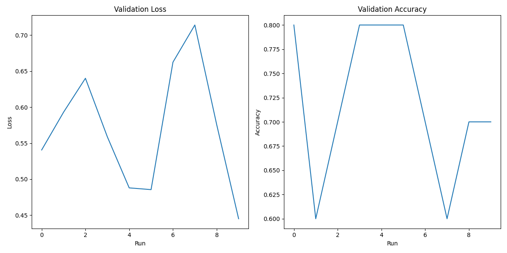
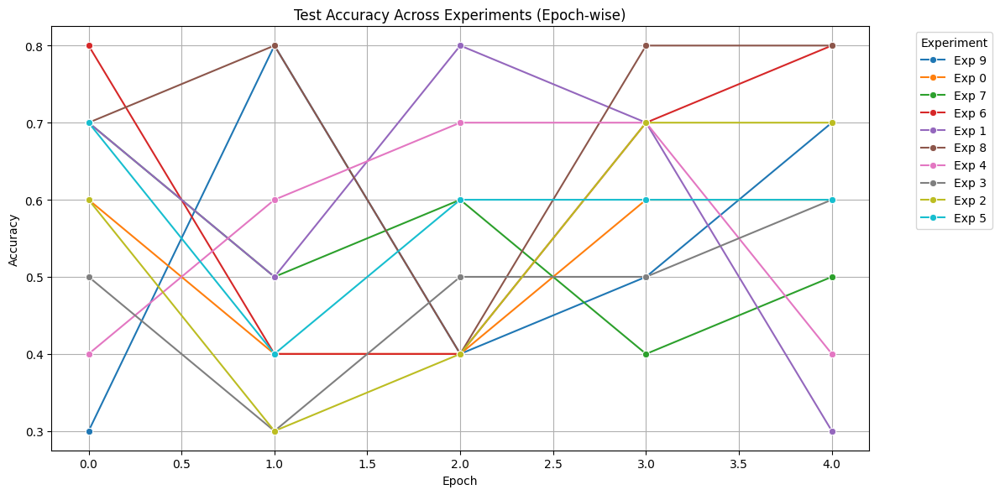

# Hyperparameter Optimization Results

### Combined Metrics Plot

### Best Hyperparameters

|    | Parameter                        | Value                  |
|---:|:---------------------------------|:-----------------------|
|  0 | name                             | optuna                 |
|  1 | model.drop_path_rate             | 0.2089407556793585     |
|  2 | model.head_init_scale            | 0.9292090024255693     |
|  3 | model.lr                         | 0.00023458293902856107 |
|  4 | model.weight_decay               | 0.0005513192559352005  |
|  5 | data.batch_size                  | 64                     |
|  6 | augmentation.horizontal_flip     | True                   |
|  7 | augmentation.random_crop         | True                   |
|  8 | augmentation.random_rotation     | True                   |
|  9 | regularization.gradient_clipping | 0.15371010694861154    |
| 10 | best_value                       | 1.0                    |

### Hyperparameters for Each Experiment

|    | base_model    |   num_classes | pretrained   |     lr | optimizer   |   weight_decay |   scheduler_patience |   scheduler_factor |   drop_path_rate |   head_init_scale | horizontal_flip   | random_crop   | random_rotation   |   val_acc |   val_loss |
|---:|:--------------|--------------:|:-------------|-------:|:------------|---------------:|---------------------:|-------------------:|-----------------:|------------------:|:------------------|:--------------|:------------------|----------:|-----------:|
|  0 | convnext_nano |             2 | False        | 0.0003 | AdamW       |         0.0010 |                    3 |             0.1000 |           0.2257 |            0.6574 | True              | True          | True              |    0.8000 |     0.5406 |
|  1 | convnext_nano |             2 | False        | 0.0002 | AdamW       |         0.0006 |                    3 |             0.1000 |           0.2089 |            0.9292 | True              | True          | True              |    0.6000 |     0.5929 |
|  2 | convnext_nano |             2 | False        | 0.0005 | AdamW       |         0.0007 |                    3 |             0.1000 |           0.0723 |            1.0152 | True              | True          | True              |    0.7000 |     0.6401 |
|  3 | convnext_nano |             2 | False        | 0.0004 | AdamW       |         0.0000 |                    3 |             0.1000 |           0.2775 |            1.7625 | True              | True          | True              |    0.8000 |     0.5590 |
|  4 | convnext_nano |             2 | False        | 0.0002 | AdamW       |         0.0002 |                    3 |             0.1000 |           0.1194 |            1.6070 | True              | True          | True              |    0.8000 |     0.4880 |
|  5 | convnext_nano |             2 | False        | 0.0003 | AdamW       |         0.0009 |                    3 |             0.1000 |           0.2148 |            0.5226 | True              | True          | True              |    0.8000 |     0.4855 |
|  6 | convnext_nano |             2 | False        | 0.0009 | AdamW       |         0.0005 |                    3 |             0.1000 |           0.1251 |            1.5220 | True              | True          | True              |    0.7000 |     0.6624 |
|  7 | convnext_nano |             2 | False        | 0.0009 | AdamW       |         0.0003 |                    3 |             0.1000 |           0.0952 |            1.1222 | True              | True          | True              |    0.6000 |     0.7140 |
|  8 | convnext_nano |             2 | False        | 0.0001 | AdamW       |         0.0004 |                    3 |             0.1000 |           0.0881 |            1.4465 | True              | True          | True              |    0.7000 |     0.5756 |
|  9 | convnext_nano |             2 | False        | 0.0006 | AdamW       |         0.0007 |                    3 |             0.1000 |           0.0287 |            1.8280 | True              | True          | True              |    0.7000 |     0.4451 |

### Test Accuracy Across Experiments (Epoch-wise)

